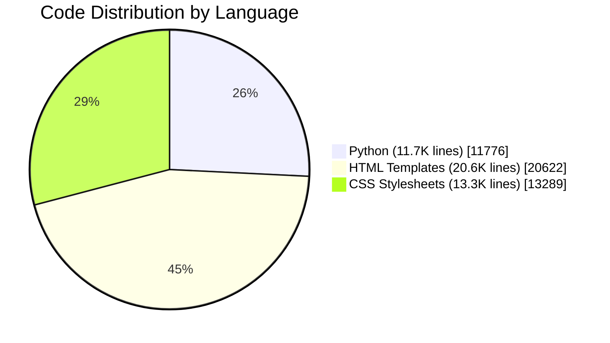

# 🏠 CoralCity Real Estate Platform

> A modern, feature-rich Django-based real estate web application with multi-language support, interactive maps, blog system, static site generation, and sophisticated admin capabilities.

🌐 **Live Demo:** [https://kuzey-emlak.lotfinity.tech](https://kuzey-emlak.lotfinity.tech)

---

## 📋 Table of Contents

- [Project Statistics](#-project-statistics)
- [Overview](#-overview)
- [Core Apps & Modules](#-core-apps--modules)
- [Key Features](#-key-features)
- [Technology Stack](#-technology-stack)
- [User Capabilities](#-user-capabilities)
- [Admin Capabilities](#-admin-capabilities)
- [API & Integration](#-api--integration)
- [Static Site Generation](#-static-site-generation)
- [Internationalization](#-internationalization)

---

## 📊 Project Statistics

> **A comprehensive enterprise-grade platform representing significant development effort and complexity.**

### 📈 Codebase Overview

| Metric | Count | Description |
|--------|------:|-------------|
| 📄 **Total Source Files** | **2,567** | Python, HTML, JavaScript, CSS files |
| 📝 **Lines of Code** | **45,000+** | Hand-written application code |
| 🐍 **Python Files** | **190** | Backend logic, models, views, APIs |
| 🌐 **HTML Templates** | **93** | Frontend pages and components |
| 🎨 **CSS Stylesheets** | **Multiple** | Custom responsive styling |
| 📁 **Project Directories** | **1,673** | Organized modular structure |

### 🏗️ Architecture Complexity

| Component | Count | Details |
|-----------|------:|---------|
| 🗄️ **Database Models** | **67** | Complex relational data structures |
| ⚙️ **Python Functions** | **603** | Business logic implementations |
| 🔀 **Database Migrations** | **110** | Schema evolution history |
| 🛣️ **URL Configurations** | **8** | Routing modules |
| 📦 **Django Apps** | **12** | Modular feature packages |
| 🔧 **Dependencies** | **40** | Third-party packages integrated |

### 🌍 Internationalization Effort

| Metric | Count |
|--------|------:|
| 🌐 **Supported Languages** | **13** |
| 📝 **Translation Files** | **12** `.po` files |
| 🔤 **Translatable Strings** | **500+** per language |



### 📸 Media & Assets

| Asset Type | Count |
|------------|------:|
| 🖼️ **Media Files** | **1,716** |
| 🏠 **Property Images** | **1,500+** |
| 🎨 **Static Assets** | **Multiple** |

### ⏱️ Development Effort

> 💪 **Real Development Stats:** This project was built with intensive 8-12 hour daily coding sessions over multiple months.

| Aspect | Actual | Details |
|--------|--------|---------|
| 👨‍💻 **Daily Work Hours** | **16-18 hours** | Straight coding sessions |
| 📅 **Development Period** | ~~3-4 months~~ **18 days** | Intensive full-time work |
| ⏰ **Total Hours Invested** | **500-700+** | Cumulative development time |
| 🔄 **Git Commits** | **Active** | Continuous iteration |
| 🧪 **Features Implemented** | **50+** | See feature list below |

### 💡 Complexity Indicators

```
Backend Complexity    ████████████████████░░░░  80%  (Django, APIs, GraphQL)
Frontend Development  ██████████████████░░░░░░  75%  (Templates, JS, CSS)
Database Design       ████████████████████░░░░  80%  (67 models, relations)
Internationalization  ████████████████████████  100% (13 languages)
DevOps & Deployment   ██████████████░░░░░░░░░░  60%  (Docker, Static Gen)
Documentation         ████████████████░░░░░░░░  65%  (README, API docs)
```

### 🎯 Key Achievements

| Achievement | Status |
|-------------|--------|
| ✅ Full-stack Django application | Complete |
| ✅ RESTful API with OpenAPI spec | Complete |
| ✅ GraphQL API for blog | Complete |
| ✅ 13-language internationalization | Complete |
| ✅ Static site generation (CDN-ready) | Complete |
| ✅ Interactive maps with Leaflet | Complete |
| ✅ Advanced image processing tools | Complete |
| ✅ Web scraping import system | Complete |
| ✅ Custom admin theme (Baton) | Complete |
| ✅ Responsive mobile-friendly design | Complete |

---

## 🎯 Overview

**CoralCity** is a sophisticated, full-featured real estate management platform built on Django. It enables real estate agencies to manage property listings, realtors, customer inquiries, and blog content through an elegant admin interface while providing users with a modern frontend experience complete with interactive maps, property search, and contact functionality.

The platform supports **13 languages**, offers **static site generation** for CDN deployment, and includes advanced **image processing tools** for watermarking and editing property photos.

### 🚀 Quick Links - Try It Now!

| Page | Link |
|------|------|
| 🏠 **Homepage** | [https://kuzey-emlak.lotfinity.tech](https://kuzey-emlak.lotfinity.tech) |
| 🏢 **All Properties** | [https://kuzey-emlak.lotfinity.tech/en/properties/](https://kuzey-emlak.lotfinity.tech/en/properties/) |
| 🗺️ **Interactive Map** | [https://kuzey-emlak.lotfinity.tech/en/map/](https://kuzey-emlak.lotfinity.tech/en/map/) |
| 💳 **Financing** | [https://kuzey-emlak.lotfinity.tech/en/financing/](https://kuzey-emlak.lotfinity.tech/en/financing/) |
| 📧 **Contact** | [https://kuzey-emlak.lotfinity.tech/en/contact/](https://kuzey-emlak.lotfinity.tech/en/contact/) |
| 📡 **API Listings** | [https://kuzey-emlak.lotfinity.tech/api/listings](https://kuzey-emlak.lotfinity.tech/api/listings) |
| 📖 **OpenAPI Spec** | [https://kuzey-emlak.lotfinity.tech/api/openapi.json](https://kuzey-emlak.lotfinity.tech/api/openapi.json) |

---

## 📦 Core Apps & Modules

### 1. **Listings** (`listings/`)
The heart of the platform - manages all property listings.

| Component | Description |
|-----------|-------------|
| `Listing` model | Complete property data: title, address, price, bedrooms, bathrooms, sqft, deal type (rent/sale), property type, GPS coordinates, building details (age, floors, heating, elevator, furnished status), complex info, fees, and more |
| `ListingImage` model | Multiple images per listing with ordering, visibility, cropping support, and primary image flag |
| `ListingImportJob` model | Automated web scraping import jobs from external real estate sites |
| Geocoding | Automatic address-to-coordinates conversion using Nominatim/Geopy |
| Deal Types | Support for "Kiralık" (Rent) and "Satış" (Sale) |

### 2. **Realtors** (`realtors/`)
Agent/realtor management.

| Feature | Description |
|---------|-------------|
| Realtor profiles | Name, photo, description, phone, email |
| MVP designation | Highlight top-performing agents |
| Hire date tracking | Agent tenure management |

### 3. **Contacts** (`contacts/`)
Inquiry and lead management system.

| Feature | Description |
|---------|-------------|
| Property inquiries | Users can submit questions about specific listings |
| User tracking | Links inquiries to registered users |
| Duplicate prevention | Prevents multiple inquiries from same user on same listing |

### 4. **Accounts** (`accounts/`)
User authentication and dashboard.

| Feature | Description |
|---------|-------------|
| Registration | Full user registration with validation |
| Login/Logout | Secure session management |
| User Dashboard | View submitted inquiries and their status |
| Password security | Hashed password storage |

### 5. **Blog** (`blog/`)
Full-featured blogging system.

| Feature | Description |
|---------|-------------|
| Posts | Title, body, featured image, author, categories |
| Categories | Organize posts by topic |
| Comments | Authenticated users can comment |
| Auto-slugs | SEO-friendly URL generation |
| Search | Full-text search across posts |
| Pagination | Paginated post listings |
| GraphQL API | Query posts and categories via GraphQL |

### 6. **Pages** (`pages/`)
Static page management and theming.

| Feature | Description |
|---------|-------------|
| Theme Settings | Customizable colors (primary, accent, background, text) |
| Font Configuration | Google Fonts integration with custom font imports |
| Custom CSS | Inject additional styling |
| Static pages | About, Financing, custom landing pages |

### 7. **Baton** (`baton/`)
Custom admin theme and enhancements.

| Feature | Description |
|---------|-------------|
| Admin Themes | Customizable admin panel appearance |
| Filter enhancements | Dropdown, input, and multiple-choice filters |
| Modern UI | Sleek, responsive admin interface |

### 8. **Image Tools** (`imagetools/`)
Advanced image processing utilities.

| Feature | Description |
|---------|-------------|
| Watermarking | Add logos with position, opacity, scale control |
| Cropping | Aspect ratio-aware cropping |
| Framing | Add borders with rounded corners |
| Corner triangles | Cover old logos with colored triangles |
| Backup system | Automatic backup before processing |

### 9. **API** (`api/`)
RESTful API endpoints.

| Endpoint | Description | Try It Live |
|----------|-------------|-------------|
| `/api/listings` | GeoJSON listing data with coordinates | [🔗 View](https://kuzey-emlak.lotfinity.tech/api/listings) |
| `/api/listings/<id>` | Single listing geo-details | [🔗 Example](https://kuzey-emlak.lotfinity.tech/api/listings/1) |
| `/api/openapi.json` | OpenAPI 3.1 specification | [🔗 Spec](https://kuzey-emlak.lotfinity.tech/api/openapi.json) |
| Spatial filtering | Bounding box (bbox) query support | - |
| CORS enabled | Cross-origin access allowed | - |

### 10. **Ages** (`Ages/`)
Age verification module for restricted content.

---

## ✨ Key Features

### 🗺️ Interactive Maps

👉 **[View Live Map](https://kuzey-emlak.lotfinity.tech/en/map/)** | **[Simplified Map](https://kuzey-emlak.lotfinity.tech/en/map-simplified/)**

- **Leaflet.js integration** with custom markers
- **Property location mapping** with photo markers
- **Nearby amenities display**:
  - 🚌 Metrobus stops
  - 🚏 Bus stops
  - 🛒 Grocery stores
  - 👕 Clothing stores
  - 🚕 Taxi stands
  - 🚐 Minibus lines
  - 🚴 Bicycle paths
- **Distance calculations** to nearest services
- **Map guide toggle** for legend display
- **Pre-generated map HTML** for each listing

### 🔍 Advanced Property Search

👉 **[Browse All Properties](https://kuzey-emlak.lotfinity.tech/en/properties/)**

- Keyword search in descriptions
- City/State filtering
- Bedroom count filter
- Price range filter
- Property type filtering
- Deal type (rent/sale) filter

### 📸 Image Management
- **Multiple images per listing** with ordering
- **Primary image designation**
- **Visibility control**
- **Built-in image editors**:
  - Toast UI Image Editor
  - Filerobot Image Editor
- **Bulk operations**:
  - Watermark application
  - Logo overlay (one-click or custom)
  - Corner cover for old logos
  - Visibility toggle
- **Easy Thumbnails** integration for responsive images

### 📥 Automated Import System
- **Web scraping integration** with Playwright
- **CSV or single URL import**
- **Cookie file support** for authenticated scraping
- **Configurable options**:
  - Delay between requests
  - Debug mode
  - Headed/headless browser
  - Skip geocoding
  - Image limit control
- **Real-time progress logging**
- **Async job execution**

### 📊 GraphQL API
```graphql
query {
  posts { title, body, author { username } }
  categories { categoryname }
  post(id: 1) { title, slug, comments { message } }
}
```
- Full CRUD mutations for posts and categories
- Introspection enabled via GraphiQL interface

---

## 🛠️ Technology Stack

| Category | Technologies |
|----------|--------------|
| **Backend** | Django 4.2, Python 3 |
| **Database** | SQLite3 (development), PostgreSQL-ready via dj-database-url |
| **Frontend** | HTML5, CSS3, JavaScript, Tailwind CSS |
| **Maps** | Leaflet.js |
| **Image Processing** | Pillow, easy-thumbnails |
| **Import/Export** | django-import-export, tablib |
| **APIs** | Graphene-Django (GraphQL), REST |
| **Web Scraping** | Playwright, BeautifulSoup4, Requests |
| **Geocoding** | Geopy (Nominatim) |
| **Static Generation** | django-distill |
| **Admin Theme** | django-baton |
| **Translation** | django-rosetta |
| **Static Files** | Whitenoise |
| **Debug** | Django Debug Toolbar |

---

## 👤 User Capabilities

### Public Users (No Login Required)
| Action | Description | Try It |
|--------|-------------|--------|
| 🏠 Browse listings | View all published properties with pagination | [Properties →](https://kuzey-emlak.lotfinity.tech/en/properties/) |
| 🔍 Search properties | Filter by keywords, location, price, bedrooms | [Properties →](https://kuzey-emlak.lotfinity.tech/en/properties/) |
| 📍 View on map | Interactive map with all listing locations | [Map →](https://kuzey-emlak.lotfinity.tech/en/map/) |
| 📄 Property details | Full property information with photo gallery | [Example →](https://kuzey-emlak.lotfinity.tech/en/listing/1/) |
| 🗺️ Nearby amenities | See transport, shops, services near property | [Map →](https://kuzey-emlak.lotfinity.tech/en/map/) |
| 📰 Read blog | Browse articles by category | Coming Soon |
| 🌐 Change language | Switch between 13 supported languages | [🇹🇷 Turkish](https://kuzey-emlak.lotfinity.tech/tr/) \| [🇩🇪 German](https://kuzey-emlak.lotfinity.tech/de/) |
| 💰 Financing info | View financing/mortgage information page | [Financing →](https://kuzey-emlak.lotfinity.tech/en/financing/) |

### Registered Users
| Action | Description |
|--------|-------------|
| 📝 Register account | Create user profile |
| 🔐 Login/Logout | Secure authentication |
| 📧 Submit inquiries | Contact realtors about listings |
| 📊 Dashboard | Track inquiry status |
| 💬 Comment on blog | Engage with blog posts |

---

## 👨‍💼 Admin Capabilities

### Listing Management
| Action | Description |
|--------|-------------|
| ➕ Create listings | Full property data entry |
| ✏️ Edit listings | Modify any property field |
| 🗑️ Delete listings | Remove properties |
| 📸 Manage images | Add, reorder, hide, edit photos |
| ✅ Publish/Unpublish | Control listing visibility |
| 📤 Import/Export | Bulk data operations via CSV, XLSX, JSON |
| 🤖 Auto-import | Web scraping import from external sites |

### Image Processing (Admin Actions)
| Action | Description |
|--------|-------------|
| 🖼️ Bulk edit images | Apply watermarks, crop, frame multiple images |
| 🏷️ Apply logo | Add company logo watermark |
| 🔺 Cover old logo | Triangle overlay to hide previous branding |
| ✂️ Crop to ratio | Enforce consistent aspect ratios |
| 🎨 In-browser editing | Toast UI & Filerobot editors |

### Realtor Management
| Action | Description |
|--------|-------------|
| 👤 Add realtors | Create agent profiles |
| ⭐ Set MVP status | Highlight top agents |
| 📞 Contact info | Manage phone/email |

### Content Management
| Action | Description |
|--------|-------------|
| 📝 Blog posts | Create, edit, categorize articles |
| 🏷️ Categories | Manage blog categories |
| 🎨 Theme settings | Customize site colors and fonts |
| 🌐 Translations | Manage translations via Rosetta |

### User & Inquiry Management
| Action | Description |
|--------|-------------|
| 👥 User management | View, edit, delete users |
| 📩 View inquiries | Monitor all property inquiries |
| 📈 Dashboard analytics | Overview of site activity |

---

## 🔗 API & Integration

### REST API Endpoints

| Endpoint | Live Link |
|----------|----------|
| `GET /api/listings` | [https://kuzey-emlak.lotfinity.tech/api/listings](https://kuzey-emlak.lotfinity.tech/api/listings) |
| `GET /api/listings?limit=10` | [https://kuzey-emlak.lotfinity.tech/api/listings?limit=10](https://kuzey-emlak.lotfinity.tech/api/listings?limit=10) |
| `GET /api/openapi.json` | [https://kuzey-emlak.lotfinity.tech/api/openapi.json](https://kuzey-emlak.lotfinity.tech/api/openapi.json) |

```
GET /api/listings
    ?limit=1000         # Max results (default 1000, max 5000)
    ?bbox=minLon,minLat,maxLon,maxLat   # Spatial filter

GET /api/listings/<id>  # Single listing geo-data

GET /api/openapi.json   # OpenAPI specification
```

### Response Format (GeoJSON)
```json
{
  "count": 150,
  "results": [
    {
      "id": 1,
      "title": "Modern Apartment in Istanbul",
      "lat": 41.0082,
      "lng": 28.9784,
      "url": "/en/listing/1/",
      "city": "Istanbul",
      "deal_type": "kiralik",
      "price": 15000,
      "original_url": "https://source-site.com/listing"
    }
  ]
}
```

### GraphQL Endpoint
```
POST /graphql/
```
- Full GraphiQL interface for exploration
- Query posts, categories, and related data

---

## 📦 Static Site Generation

The platform supports **full static site export** using django-distill for deployment to CDN/static hosting.

### Build Command
```bash
bash scripts/build_static.sh [--zip]
```

### What Gets Generated
| Output | Location |
|--------|----------|
| All pages | `distill_output/<lang>/...` |
| Static assets | `distill_output/static/` |
| Media files | `distill_output/media/` |
| Map data JSON | `distill_output/listings/map-data/` |

### Generated Pages Per Language
- Homepage
- Properties listing (with pagination)
- Individual property details
- Map view
- Contact page
- Financing page
- 404 page

### Deployment Targets
- Netlify
- GitHub Pages
- AWS S3
- Any static file host

---

## 🌐 Internationalization

### Supported Languages (13)

| Code | Language | Live Link |
|------|----------|----------|
| 🇬🇧 `en` | English | [→ Visit](https://kuzey-emlak.lotfinity.tech/en/) |
| 🇹🇷 `tr` | Türkçe | [→ Visit](https://kuzey-emlak.lotfinity.tech/tr/) |
| 🇫🇷 `fr` | Français | [→ Visit](https://kuzey-emlak.lotfinity.tech/fr/) |
| 🇪🇸 `es` | Español | [→ Visit](https://kuzey-emlak.lotfinity.tech/es/) |
| 🇮🇹 `it` | Italiano | [→ Visit](https://kuzey-emlak.lotfinity.tech/it/) |
| 🇵🇱 `pl` | Polski | [→ Visit](https://kuzey-emlak.lotfinity.tech/pl/) |
| 🇵🇹 `pt` | Português | [→ Visit](https://kuzey-emlak.lotfinity.tech/pt/) |
| 🇭🇺 `hu` | Magyar | [→ Visit](https://kuzey-emlak.lotfinity.tech/hu/) |
| 🇷🇺 `ru` | Русский | [→ Visit](https://kuzey-emlak.lotfinity.tech/ru/) |
| 🇸🇦 `ar` | العربية | [→ Visit](https://kuzey-emlak.lotfinity.tech/ar/) |
| 🇩🇪 `de` | Deutsch | [→ Visit](https://kuzey-emlak.lotfinity.tech/de/) |
| 🇧🇬 `bg` | български | [→ Visit](https://kuzey-emlak.lotfinity.tech/bg/) |
| 🇳🇱 `nl` | Nederlands | [→ Visit](https://kuzey-emlak.lotfinity.tech/nl/) |

### Features
- **URL prefix per language** (`/en/`, `/tr/`, `/fr/`, etc.)
- **Django Rosetta** for in-browser translation management
- **Auto-compile** `.po` to `.mo` files
- **Language switcher** in frontend

---

## 🏗️ Project Structure

```
coralcity/
├── accounts/          # User auth & dashboard
├── Ages/              # Age verification
├── api/               # REST API endpoints
├── baton/             # Admin theme & enhancements
├── blog/              # Blogging system + GraphQL
├── contacts/          # Inquiry management
├── coralcity/         # Project settings & URLs
├── distill_output/    # Static site output
├── imagetools/        # Image processing utilities
├── listings/          # Core property management
├── locale/            # Translation files
├── maps/              # Map-related assets
├── media/             # Uploaded files
├── pages/             # Static pages & theming
├── realtors/          # Agent management
├── scripts/           # Build & utility scripts
├── staticfiles/       # Collected static files
└── templates/         # HTML templates
    ├── admin/         # Custom admin templates
    ├── newfrontend/   # Modern frontend templates
    └── partials/      # Reusable template fragments
```

---

## 🚀 Quick Start

```bash
# Create virtual environment
python -m venv venv
source venv/bin/activate

# Install dependencies
pip install -r requirements.txt

# Run migrations
python manage.py migrate

# Create superuser
python manage.py createsuperuser

# Run development server
python manage.py runserver

# Build static site
bash scripts/build_static.sh
```

---

## 📝 Summary

**CoralCity** is a comprehensive real estate platform that combines:

- ✅ **Property Management** - Full CRUD with advanced filtering
- ✅ **Interactive Maps** - Leaflet with amenity distance calculations
- ✅ **Image Processing** - Watermarking, cropping, editing
- ✅ **Multi-language** - 13 languages with easy translation management
- ✅ **Blog System** - Categories, comments, GraphQL API
- ✅ **User System** - Registration, dashboard, inquiry tracking
- ✅ **Import Automation** - Web scraping with Playwright
- ✅ **Static Generation** - Deploy to any CDN
- ✅ **Modern Admin** - Baton theme with bulk actions
- ✅ **REST & GraphQL APIs** - Flexible data access

This is a production-ready, scalable solution for real estate agencies looking for a modern, feature-complete web presence.

---

*Generated on December 2, 2025*
